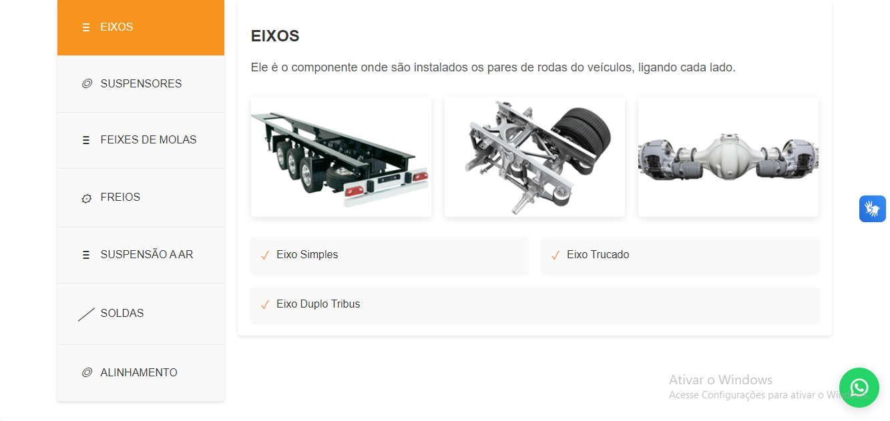
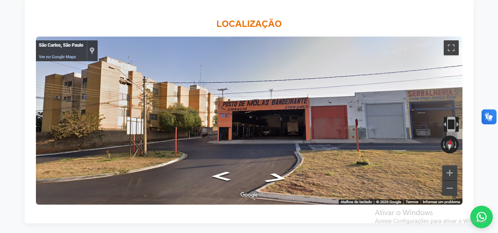

# Posto de Molas Bandeirante

Projeto institucional desenvolvido para o Posto de Molas Bandeirante, com foco na apresentação da empresa, dos serviços para veículos pesados e dos canais de contato em São Carlos.

## Visão geral

O projeto foi construído como um website estático para apresentar:

- a marca, a história e a estrutura do Posto de Molas Bandeirante;
- serviços de suspensão, freios, feixes de molas, alinhamento e solda;
- informações de contato, localização e redes sociais;
- uma experiência responsiva para desktop e dispositivos móveis.

## Stack

- HTML5
- CSS3
- JavaScript
- Font Awesome 6.5.0 via CDN
- Apache `htaccess` para redirecionamento HTTP para HTTPS
- Imagens, áudio e demais arquivos estáticos locais

## Destaques

- navegação entre páginas institucionais;
- menu responsivo e carrosséis de conteúdo;
- apresentação visual dos serviços e da estrutura da empresa;
- reprodução de áudio institucional;
- formulário e links de contato, WhatsApp e redes sociais;
- páginas de privacidade e sitemap para apoio à publicação do site.

## Screenshots

### Página inicial

### Serviços

### Localização e contato

## Arquitetura

O repositório é composto por páginas HTML independentes na raiz, uma folha de estilos compartilhada, scripts de interação e arquivos de mídia locais:

- camada de apresentação: `index.html`, `sobre.html`, `estrutura.html`, `servicos.html`, `contato.html` e `privacidade.html`;
- estilos e comportamento: `css/` e `js/`;
- conteúdo visual e áudio: `img/` e `audio/`;
- publicação e indexação: `htaccess`, `robots.txt` e `sitemap.xml`;
- documentação técnica complementar: `docs/`.

Não há backend, banco de dados, autenticação, framework de aplicação, processo de build ou gerenciador de dependências no projeto.

## Execução local

O site pode ser aberto diretamente pelo arquivo `index.html` ou servido por qualquer servidor HTTP estático. Não há instalação de dependências necessária.

Para publicação, a pasta raiz pode ser hospedada em um serviço de hospedagem estática ou em um servidor Apache. A configuração `htaccess` deve ser usada somente em ambientes Apache.

## Documentação

- [Arquitetura](docs/architecture.md)
- [Instalação e execução](docs/installation.md)
- [Requisitos](docs/requirements.md)
- [Roadmap](docs/roadmap.md)
- [Tecnologias](docs/technologies.md)
- [Workflow](docs/workflow.md)

## Observação importante

Este repositório contém a implementação de apresentação do site institucional. O projeto não possui licença de código aberto definida e não inclui backend ou área administrativa.

## Site

[www.postodemolasbandeirante.com.br](https://www.postodemolasbandeirante.com.br/)
